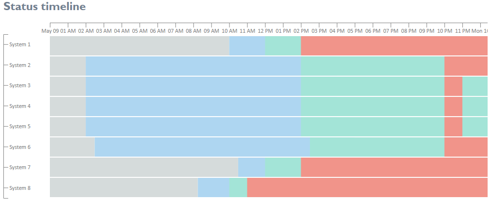

# Description

Project implements logic based on d3 library to build stacked status timelins as follow:



# How to use

### Create configuration
```
const configuration: TimelineConfiguration = {
      width: 1000,
      fontSize: 12,
      font: 'calibri',
      rowHeight: 40,
      rowPadding: 2,
      tickSize: 10,
      tickPadding: 2.5,
      tickColor: '#808181',
      tickIntervalMins: 60,
      onClickRect: (item) => this.clickOnRect(item),
    };
```

### Prepare data set to format
```
const history: HistoryItem[] = [
  {
    source: 'System 1',
    status: statuses.BLUE,
    dateTime: new Date(2021, 4, 9, 10, 0),
  },
  
  {
    source: 'System 1',
    status: statuses.GREEN,
    dateTime: new Date(2021, 4, 9, 12, 0),
  },
  {
    source: 'System 1',
    status: statuses.GREEN,
    dateTime: new Date(2021, 4, 9, 13, 0),
  },
  {
    source: 'System 1',
    status: statuses.RED,
    dateTime: new Date(2021, 4, 9, 14, 0),
  },
  {
    source: 'System 1',
    status: statuses.RED,
    dateTime: new Date(2021, 4, 9, 15, 0),
  },
  {
    source: 'System 1',
    status: statuses.GREEN,
    dateTime: new Date(2021, 4, 10, 15, 0),
  },

  // system 2

  {
    source: 'System 2',
    status: statuses.BLUE,
    dateTime: new Date(2021, 4, 9, 2, 0),
  },
  {
    source: 'System 2',
    status: statuses.BLUE,
    dateTime: new Date(2021, 4, 9, 7, 0),
  },

  ...
```

### Draw timeline
```
const timelineChart = new TimelineChart(configuration);
    timelineChart.draw(
      '#chart-timeline',
      history,
      new Date(2021, 4, 9, 0, 0),
      new Date(2021, 4, 10, 3, 0)
    );
```

# D3StackedStatusTimeline

This project was generated with [Angular CLI](https://github.com/angular/angular-cli) version 11.2.2.

## Development server

Run `ng serve` for a dev server. Navigate to `http://localhost:4200/`. The app will automatically reload if you change any of the source files.

## Code scaffolding

Run `ng generate component component-name` to generate a new component. You can also use `ng generate directive|pipe|service|class|guard|interface|enum|module`.

## Build

Run `ng build` to build the project. The build artifacts will be stored in the `dist/` directory. Use the `--prod` flag for a production build.

## Running unit tests

Run `ng test` to execute the unit tests via [Karma](https://karma-runner.github.io).

## Running end-to-end tests

Run `ng e2e` to execute the end-to-end tests via [Protractor](http://www.protractortest.org/).

## Further help

To get more help on the Angular CLI use `ng help` or go check out the [Angular CLI Overview and Command Reference](https://angular.io/cli) page.
